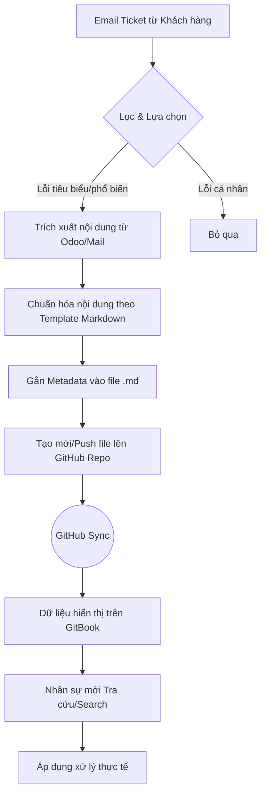
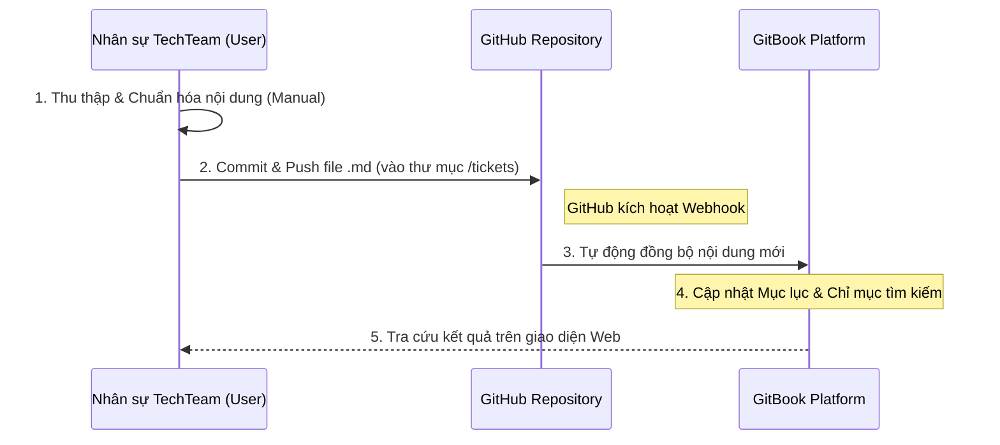
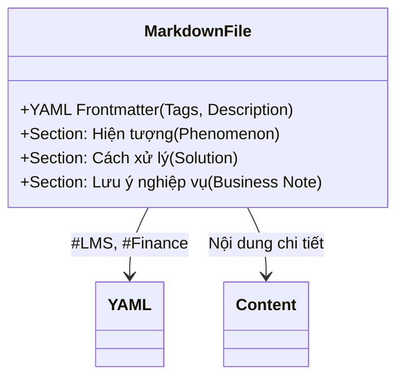

# QUY TRÌNH VẬN HÀNH (WORKFLOW DIAGRAMS) - GIAI ĐOẠN 1

## 1. Quy trình Nghiệp vụ Hiện tại (Current Business Workflow)
Sơ đồ mô tả luồng công việc thủ công: Từ lúc nhận Mail đến khi đăng tải lên GitHub để đồng bộ GitBook.

---

## 2. Luồng Tương tác Hệ thống (System Sync Flow)
Mô tả cách dữ liệu được luân chuyển giữa các nền tảng trong giai đoạn thủ công hiện tại.

---

## 3. Cấu trúc chuẩn của một bài viết (Template Structure)
Đảm bảo mọi thành viên khi đăng bài lên GitHub đều tuân theo quy chuẩn này để GitBook hiển thị tốt nhất.

